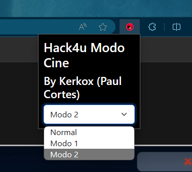

<h1 align="center"> Hack4U Modo Cine</h1>

## Agrega un botón al menu superior para cambiar entre el modo normal y el modo cine.

## Ejemplo:

## Características

- Se mantiene la opción de modo cine incluso en el cambio de videos o recarga de la web
- Se guarda el estado de modo Cine en el `localStorage`

## Instalación

Aqui esta el enlace para la instalacion: [clic aqui](https://chromewebstore.google.com/detail/hack4u-modo-cine/pffdaojoombnflnpafhiccglbabhkkop?hl=es)

Al instalarla solo tienes que refrescar la página, el boton para intercambiar entre el modo cine y el modo normal aparecerá en la parte superior de la siguiente forma:

- 🎥 : para habilitar el modo cine
- ❌ : para deshabilitar el modo cine

dentro del popup de la extension hay un selector para intercambiar entre modos, por ahora hay 2 modos:

